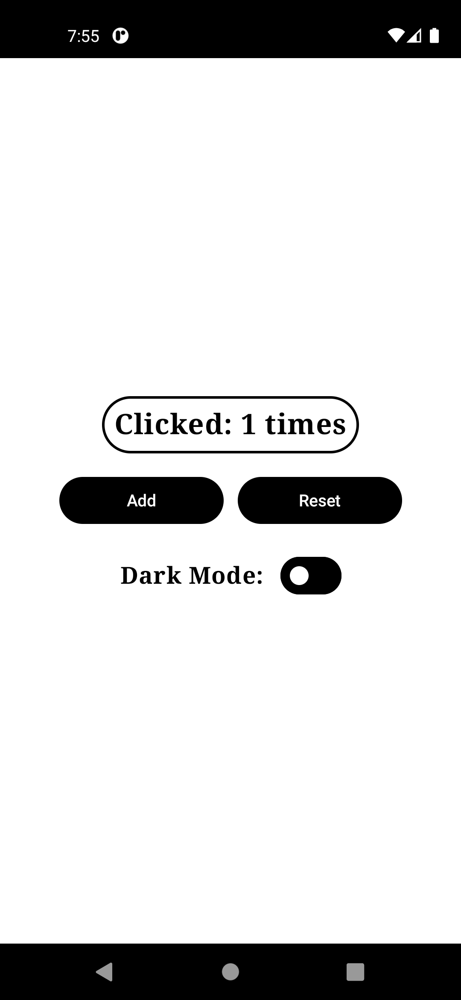
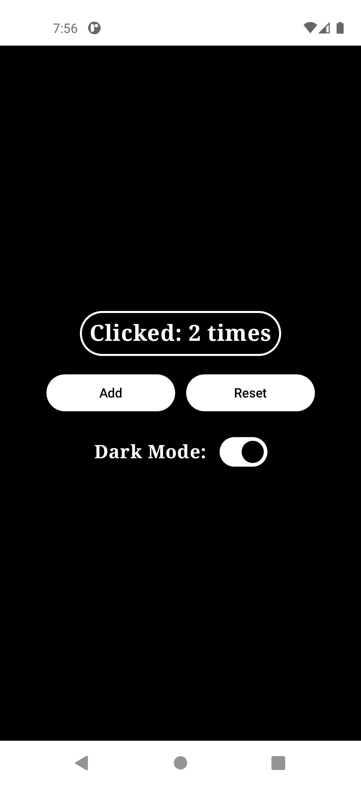

# 🧮 CounterApp

A simple Jetpack Compose app to demonstrate:

- ✅ MVVM (ViewModel)
- ✅ Light/Dark Mode toggle
- ✅ System UI Controller (Status & Navigation bar color)
- ✅ Material 3 Design

## ✨ Features

- Count display and reset
- Dark mode switch
- Clean architecture using ViewModel
- Compose-based layout

## 🧱 Built With

- [Jetpack Compose](https://developer.android.com/jetpack/compose)
- [Material 3](https://m3.material.io/)
- [ViewModel](https://developer.android.com/topic/libraries/architecture/viewmodel)
- [Accompanist SystemUiController](https://google.github.io/accompanist/systemuicontroller/)

## 📷 Screenshots

| Home Screen                        | Dark Mode                          |
|------------------------------------|------------------------------------|
|  |  |

## 🚀 Getting Started

Clone the project:

```bash
git clone https://github.com/asta-JC/CounterApp.git
